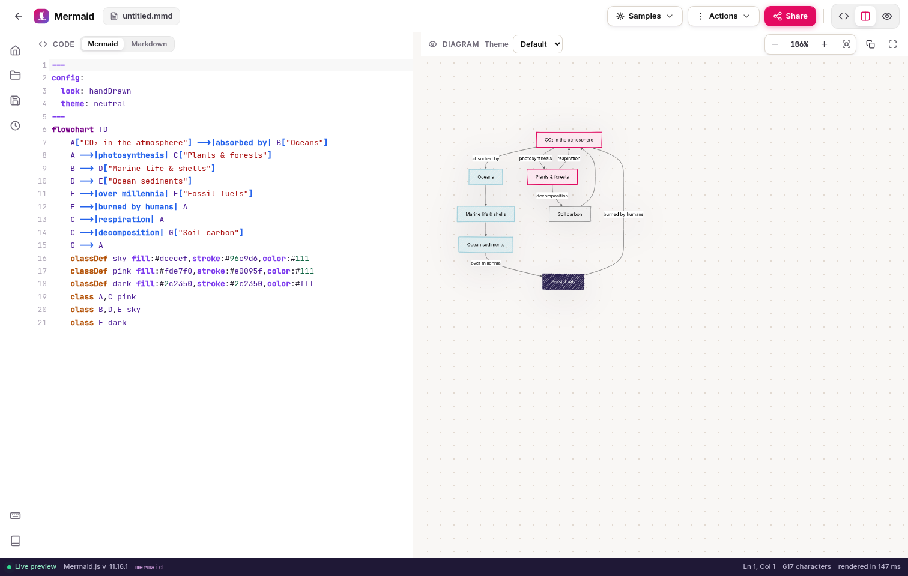
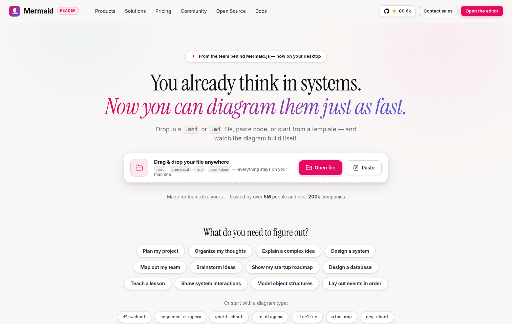
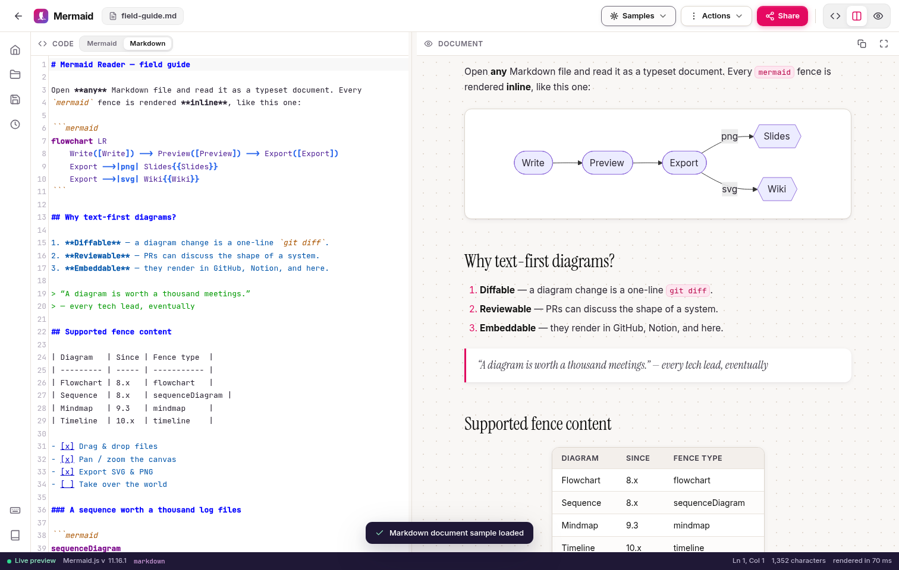
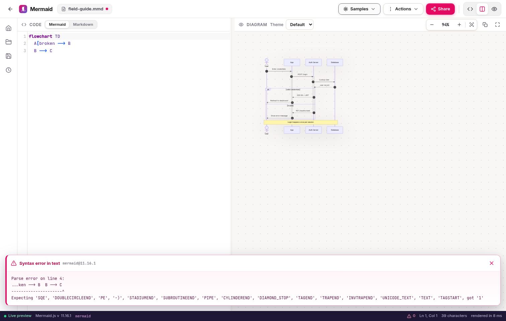
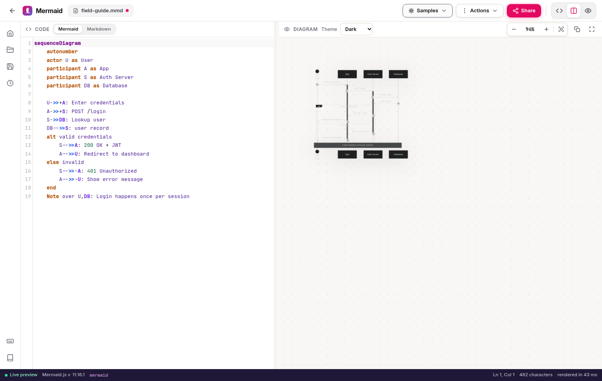
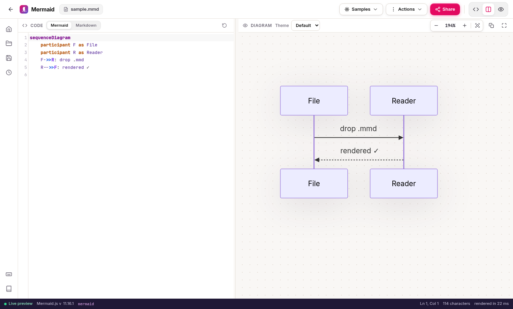
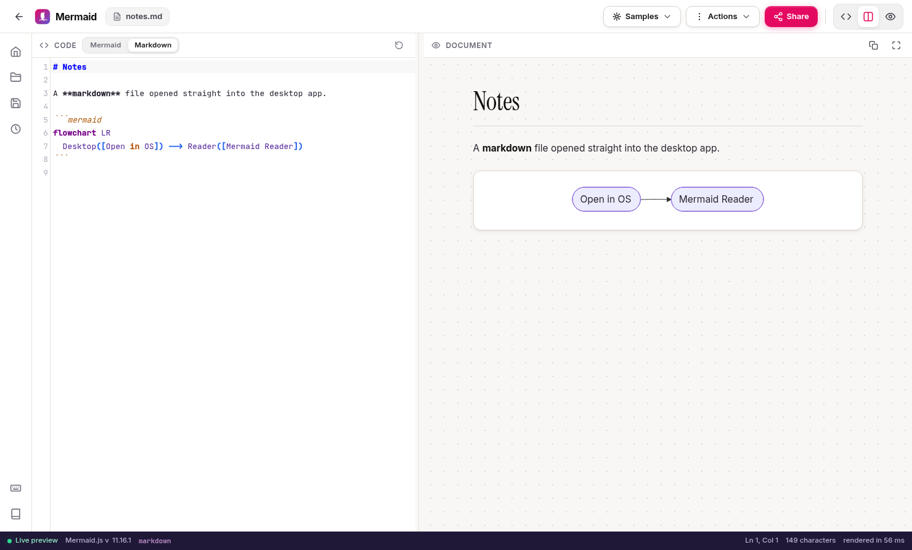

<p align="center">
  
</p>

<h1 align="center">mmd-reader</h1>

<p align="center">
  <b>An offline, fully local desktop reader for Mermaid diagrams &amp; Markdown documents.</b><br/>
  Code on the left, live diagram on the right. No accounts, no servers, no telemetry —<br/>
  it works exactly the same with your network cable unplugged.
</p>

<p align="center">
  <a href="https://github.com/Lucifer-Newstar/mmd-reader/actions/workflows/check.yml"></a>
  <a href="LICENSE"></a>
  
  
  <a href="https://github.com/Lucifer-Newstar/mmd-reader/blob/main/CONTRIBUTING.md"></a>
</p>

<p align="center">
  
</p>

---

## Why

[`mermaid.live`](https://mermaid.live) is a browser tab. Files on your disk — `architecture.mmd`,
`spec.md` with a dozen ` ```mermaid ` fences — deserve a real desktop citizen that opens on
double-click, watches the file for external edits, and never phones home. That's mmd-reader.

The look borrows openly from [mermaid.ai](https://mermaid.ai): cream canvas, `#e0095f` pink,
Instrument Serif display type — inside, it's the Mermaid Live Editor workflow you already know.

## Features

**Reads your files**
- Opens `.mmd` · `.mermaid` · `.md` · `.markdown` · `.txt` — dialog, drag &amp; drop, paste,
  double-click in the file manager (file associations registered by the installer),
  `Open Recent`, CLI argument, second-instance forwarding.
- **Live file watch**: edit the file in your IDE, the preview reloads on save
  (never clobbers unsaved in-app edits — it tells you instead).
- Markdown renders as a typeset document: branded typography, tables, task lists, blockquotes,
  code blocks — with every ` ```mermaid ` fence **rendered inline**. Heading outline panel and
  reading-time stats included.
- Auto-detects Mermaid vs Markdown; manual toggle if your file is being clever.
- Session restore: relaunch and you're back where you were. Stored locally, obviously.

**Live editor**
- CodeMirror with a bespoke Mermaid syntax theme, line numbers, active line, bracket matching.
- Split / code-only / preview-only layouts, draggable gutter, fullscreen preview.
- Canvas: drag to pan, cursor-anchored wheel zoom, fit-to-view, 100% reset.
- Five Mermaid themes — default · neutral · forest · dark · base.
- mermaid.live-style error card; your last good render stays up while you fix syntax.
- 17 parser-verified sample diagrams, one click from the **Samples** menu or the home-page chips.

**Export &amp; share — locally**
- **PNG** (retina ×2.5, fonts embedded), **SVG** (vector, fonts embedded), **PDF**
  (exact-fit page for diagrams, paged A4 for documents).
- Copy diagram as image, copy as ` ```mermaid ` Markdown embed.
- pako-deflated share links (`#/pako:…`, mermaid.live-style) — 100% offline, the document
  *is* the link.

**Desktop integration**
- Native menus with accelerators, unsaved-changes guard on close, window-state restore,
  single-instance, custom About dialog.
- One command to installers: Windows NSIS + portable · macOS DMG · Linux AppImage + deb.

## Install

Prebuilt packages land on the
[Releases](https://github.com/Lucifer-Newstar/mmd-reader/releases) page.

### From source (any OS)

```bash
git clone https://github.com/Lucifer-Newstar/mmd-reader.git
cd mmd-reader
npm install        # dev-only: electron + electron-builder. runtime deps: zero.
npm start
```

### Build installers

```bash
npm run dist        # current OS  →  dist-app/
npm run dist:win    # NSIS installer + portable exe      (needs Windows or Wine)
npm run dist:mac    # DMG                                  (macOS only)
npm run dist:linux  # AppImage + .deb
```

### Keyboard

| Action                    | Shortcut                          |
| ------------------------- | --------------------------------- |
| Open file                 | `Ctrl/Cmd + O`                    |
| Save / Save as            | `Ctrl/Cmd + S` / `⇧ ⌃ + S`        |
| Export PNG / SVG / PDF    | `⌘ E` · `⇧ ⌘ E` · `⌘ P`           |
| Copy diagram as image     | `⇧ ⌘ C`                           |
| Copy share link           | `⇧ ⌘ L`                           |
| Code / Split / Preview    | `Alt ⌘ 1 · 2 · 3`                 |
| Zoom / fit                | `⌘ +` `⌘ −` `⌘ 0` + double-click  |
| Shortcuts sheet           | `⌘ /`                             |

## The offline guarantee

`npm run check` (runs in CI on every push) enforces it:

- renderer boot path (HTML/CSS/fonts) contains **zero** remote resources
- no `fetch` / `XMLHttpRequest` / `WebSocket` / `sendBeacon` to the network
- strict CSP (`script-src 'self'`) — user-file HTML never executes; Markdown is
  DOMPurify-sanitized; Mermaid runs `securityLevel: 'strict'`
- the renderer is sandboxed (`contextIsolation`, no `nodeIntegration`),
  talking to the OS only through an allowlisted preload bridge
- **zero runtime npm dependencies** — all rendering libraries are vendored

The only traffic this app can produce is a documentation/GitHub link you explicitly click,
opened in your default browser. Nothing is loaded into the app window.

Also see [SECURITY.md](SECURITY.md).

## Gallery

| | |
| --- | --- |
|  |  |
|  |  |
|  |  |

## Architecture

```
mmd-reader/
├── main/            Electron main — window, menus, dialogs, IPC, fs watch, print-to-PDF
│   └── preload.js   contextBridge → window.desktop (allowlisted channels only)
├── renderer/        The whole UI. Plain HTML/CSS/JS, zero network, zero build step
│   ├── js/app.js        render pipeline, pan/zoom canvas, files, share links, session
│   ├── js/samples.js    17 parser-verified samples + home-chip mappings
│   ├── js/mermaid-mode.js  CodeMirror mode for Mermaid syntax
│   ├── vendor/          mermaid 11.16.1 · marked · DOMPurify · CodeMirror 5 (vendored)
│   └── fonts/           Instrument Serif · Inter · JetBrains Mono (local woff2)
├── scripts/         check.js (CI gate) · smoke.js / validate.js (puppeteer, opt-in)
└── assets/          App icon
```

No bundler on purpose: what you read is what runs.

## Contributing

Yes please — read [CONTRIBUTING.md](CONTRIBUTING.md) first (short version: be kind, keep it
offline, `npm run check` must pass). Sample diagrams are the perfect first PR.

## License

[MIT](LICENSE) © 2026 [Navin Jairam](https://github.com/Lucifer-Newstar).

Bundled components ship under their own permissive licenses (MIT / MPL-2.0 / Apache-2.0 /
OFL-1.1 — see `LICENSE`). Rendering by the excellent
[Mermaid.js](https://github.com/mermaid-js/mermaid). mmd-reader is an unofficial reader
inspired by mermaid.ai and is not affiliated with Mermaid Chart, Inc.
